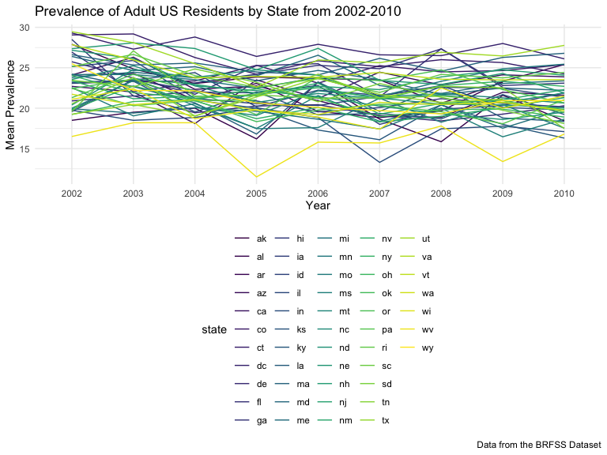
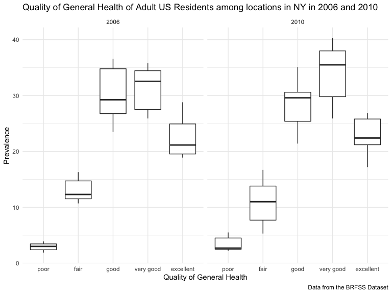
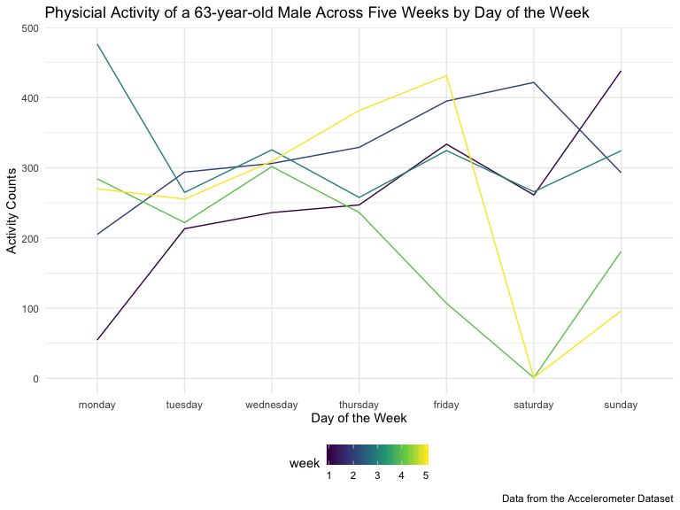
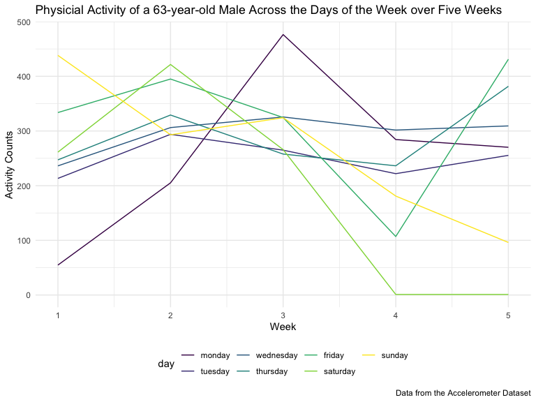
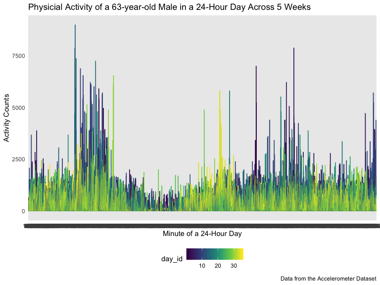

Homework\_3
================
Kodiak Soled
10/11/2019

# Prework

*Note to TAs: you may need to* `install.packages(kableExtra)` *to run my
code.*

### First, we need to load the packages we will need for this homework assignment as well as Jeff’s favorite settings that will be applied to this entire R Markdown document:

``` r
library(viridis)
```

    ## Loading required package: viridisLite

``` r
library(tidyverse)
```

    ## ── Attaching packages ────────────────────────────────────── tidyverse 1.2.1 ──

    ## ✔ ggplot2 3.2.1     ✔ purrr   0.3.2
    ## ✔ tibble  2.1.3     ✔ dplyr   0.8.3
    ## ✔ tidyr   1.0.0     ✔ stringr 1.4.0
    ## ✔ readr   1.3.1     ✔ forcats 0.4.0

    ## ── Conflicts ───────────────────────────────────────── tidyverse_conflicts() ──
    ## ✖ dplyr::filter() masks stats::filter()
    ## ✖ dplyr::lag()    masks stats::lag()

``` r
library(kableExtra)
```

    ## 
    ## Attaching package: 'kableExtra'

    ## The following object is masked from 'package:dplyr':
    ## 
    ##     group_rows

``` r
knitr::opts_chunk$set(
    echo = TRUE,
    warning = FALSE,
    fig.width = 8, 
  fig.height = 6,
  out.width = "90%"
)

options(
  ggplot2.continuous.colour = "viridis",
  ggplot2.continuous.fill = "viridis"
)

scale_colour_discrete = scale_colour_viridis_d

scale_fill_discrete = scale_fill_viridis_d

theme_set(theme_minimal() + theme(legend.position = "bottom"))
```

# Problem 1

## Instacart Dataset

### We first need to load the data from the `p8105.datasets` and tidy the dataset before we can begin exploring it:

``` r
library(p8105.datasets)
data("instacart")

cleaned_instacart = 
  instacart %>%
  janitor::clean_names() %>%
  mutate(product_name = str_to_lower(product_name))
```

### We can use the `str` function to compactly display the internal structure of the data and begin exploring its size and structure:

``` r
str(cleaned_instacart)
```

    ## Classes 'tbl_df', 'tbl' and 'data.frame':    1384617 obs. of  15 variables:
    ##  $ order_id              : int  1 1 1 1 1 1 1 1 36 36 ...
    ##  $ product_id            : int  49302 11109 10246 49683 43633 13176 47209 22035 39612 19660 ...
    ##  $ add_to_cart_order     : int  1 2 3 4 5 6 7 8 1 2 ...
    ##  $ reordered             : int  1 1 0 0 1 0 0 1 0 1 ...
    ##  $ user_id               : int  112108 112108 112108 112108 112108 112108 112108 112108 79431 79431 ...
    ##  $ eval_set              : chr  "train" "train" "train" "train" ...
    ##  $ order_number          : int  4 4 4 4 4 4 4 4 23 23 ...
    ##  $ order_dow             : int  4 4 4 4 4 4 4 4 6 6 ...
    ##  $ order_hour_of_day     : int  10 10 10 10 10 10 10 10 18 18 ...
    ##  $ days_since_prior_order: int  9 9 9 9 9 9 9 9 30 30 ...
    ##  $ product_name          : chr  "bulgarian yogurt" "organic 4% milk fat whole milk cottage cheese" "organic celery hearts" "cucumber kirby" ...
    ##  $ aisle_id              : int  120 108 83 83 95 24 24 21 2 115 ...
    ##  $ department_id         : int  16 16 4 4 15 4 4 16 16 7 ...
    ##  $ aisle                 : chr  "yogurt" "other creams cheeses" "fresh vegetables" "fresh vegetables" ...
    ##  $ department            : chr  "dairy eggs" "dairy eggs" "produce" "produce" ...

### Description

  - We can see that there are 1384617 observations of 15 variables for a
    total of 20769255 values in the Instacart dataset. The majority of
    the variables are integers, but four are character vectors
    (`department`, `aisle`, `product_name`, and `eval_set`).
  - Some key variables in this dataset include the order and product
    identifier, the name of the product, the name and identifier of the
    department and aisle, and several variables that include information
    about the ordering history of each product.
  - An illustrative example in this dataset is that an “organic hass
    avocado” (product identifier \#47209) was purchased by customer
    \#112108 at 10 am on the 4th day of the week. This produce is
    located in the “fresh fruit” aisle (aisle identifier \#24) which is
    part of the “produce” department (department identifier \#4). In
    total, there were 7293 organic hass avocados ordered in this
    dataset. Another way of looking at this dataset is that customer
    \#112108 placed an order at 10 am (order identifier \#1) which had
    eight items in it (“bulgarian yogurt”, “organic 4% milk fat whole
    milk cottage cheese”, “organic celery hearts”, “cucumber kirby”,
    “lightly smoked sardines in olive oil”, “bag of organic bananas”,
    “organic hass avocado”, and “organic whole string chees”e) which
    came from three departments (“dairy eggs”, “produce”, and “canned
    goods”).

## Problem 1 Questions

### First, we can determine the number of aisles in the Instacart dataaset by grouping the dataset by aisle (`group_by`) then counting the number of aisles (`count`). We can also determine which aisles most items are ordered from by arranging the data in descending order (`arrange(desc(n))`):

``` r
aisle = 
  cleaned_instacart %>% 
  group_by(aisle) %>%
  count() %>%
  arrange(desc(n)) 
aisle
```

    ## # A tibble: 134 x 2
    ## # Groups:   aisle [134]
    ##    aisle                              n
    ##    <chr>                          <int>
    ##  1 fresh vegetables              150609
    ##  2 fresh fruits                  150473
    ##  3 packaged vegetables fruits     78493
    ##  4 yogurt                         55240
    ##  5 packaged cheese                41699
    ##  6 water seltzer sparkling water  36617
    ##  7 milk                           32644
    ##  8 chips pretzels                 31269
    ##  9 soy lactosefree                26240
    ## 10 bread                          23635
    ## # … with 124 more rows

### Description

  - From this tibble, we can see there are 134 aisles in this dataset.
    The most orders are from the fresh vegetables and fresh fruits
    aisles with 150,609 and 150,473 orders from each aisle,
    respectively.

### Next we can make a plot using `geom_bar` within `ggplot` that shows the number of items ordered in each aisle, for aisles with more than 10,000 items ordered by using the `filter` function. We can take a few more steps so that the aisles are arranged sensibly by reordering the aisles using the `forcats::fct_reorder` function and flipping the x and y axis so it is easier to read the names of the aisles using `coord_flip`:

``` r
cleaned_instacart %>%
  count(aisle) %>%
  filter(n > 10000) %>%
  mutate(aisle = forcats::fct_reorder(aisle, n, .desc = TRUE)) %>%
  ggplot(aes(x = aisle, y = n)) +
  geom_bar(stat = "identity") + coord_flip() +
  labs(
    title = "Number of Items Ordered per Aisles (>10,000)",
    x = "Number of Items Ordered",
    y = "Aisle Name", 
    caption = "Data from the Instacart Dataset"
    )
```


### Description

  - It is also evident from this bar plot that the “fresh vegetables”
    and “fresh fruits” aisles are clearly the most popular aisles to
    order
from.

### To make a table with the three most popular items in each of the aisles “baking ingredients”, “dog food care”, and “packaged vegetables fruits”, we need to perform several steps. We need to:

  - Reduce our dataframe by first `select`ing the rows we care about
    (“aisle” and “product\_name”) then `filter`ing so only the three
    aisles we care about are present in the dataset
  - Count the number of times each product was ordered using `count`,
    group the products by the aisle they are from using `group_by`, then
    select the top three products in each aisle using `top_n`
  - Create a rank varaible to specify the popularity of each product
    from each aisle using `rank(desc(n))`
  - Organize the dataset for increased ease of reading by `arrange`ing
    the products in each aisle in descending order
  - Produce our reader-friendly table using `knitr::kable`:

<!-- end list -->

``` r
cleaned_instacart %>%
  select(aisle, product_name) %>%
  filter(
    aisle == "baking ingredients" |
      aisle == "packaged vegetables fruits" |
      aisle == "dog food care"
    ) %>%
  count(product_name, aisle) %>%
  group_by(aisle) %>%
  top_n(n = 3) %>%
  mutate(
    rank(desc(n))
    ) %>%
  rename(rank = 'rank(desc(n))') %>%
  select(aisle, product_name, n, rank) %>%
  arrange(aisle, desc(n)) %>%
  knitr::kable(caption = "Three Most Popular Items among the Baking Ingredients, Packaged Vegetable Fruits, and Dog Food Car Aisles") %>%
  kable_styling(bootstrap_options = c("striped", "condensed", font_size = 12))
```

    ## Selecting by n

<table class="table table-striped table-condensed" style="margin-left: auto; margin-right: auto;">

<caption>

Three Most Popular Items among the Baking Ingredients, Packaged
Vegetable Fruits, and Dog Food Car Aisles

</caption>

<thead>

<tr>

<th style="text-align:left;">

aisle

</th>

<th style="text-align:left;">

product\_name

</th>

<th style="text-align:right;">

n

</th>

<th style="text-align:right;">

rank

</th>

</tr>

</thead>

<tbody>

<tr>

<td style="text-align:left;">

baking ingredients

</td>

<td style="text-align:left;">

light brown sugar

</td>

<td style="text-align:right;">

499

</td>

<td style="text-align:right;">

1

</td>

</tr>

<tr>

<td style="text-align:left;">

baking ingredients

</td>

<td style="text-align:left;">

pure baking soda

</td>

<td style="text-align:right;">

387

</td>

<td style="text-align:right;">

2

</td>

</tr>

<tr>

<td style="text-align:left;">

baking ingredients

</td>

<td style="text-align:left;">

cane sugar

</td>

<td style="text-align:right;">

336

</td>

<td style="text-align:right;">

3

</td>

</tr>

<tr>

<td style="text-align:left;">

dog food care

</td>

<td style="text-align:left;">

snack sticks chicken & rice recipe dog treats

</td>

<td style="text-align:right;">

30

</td>

<td style="text-align:right;">

1

</td>

</tr>

<tr>

<td style="text-align:left;">

dog food care

</td>

<td style="text-align:left;">

organix chicken & brown rice recipe

</td>

<td style="text-align:right;">

28

</td>

<td style="text-align:right;">

2

</td>

</tr>

<tr>

<td style="text-align:left;">

dog food care

</td>

<td style="text-align:left;">

small dog biscuits

</td>

<td style="text-align:right;">

26

</td>

<td style="text-align:right;">

3

</td>

</tr>

<tr>

<td style="text-align:left;">

packaged vegetables fruits

</td>

<td style="text-align:left;">

organic baby spinach

</td>

<td style="text-align:right;">

9784

</td>

<td style="text-align:right;">

1

</td>

</tr>

<tr>

<td style="text-align:left;">

packaged vegetables fruits

</td>

<td style="text-align:left;">

organic raspberries

</td>

<td style="text-align:right;">

5546

</td>

<td style="text-align:right;">

2

</td>

</tr>

<tr>

<td style="text-align:left;">

packaged vegetables fruits

</td>

<td style="text-align:left;">

organic
blueberries

</td>

<td style="text-align:right;">

4966

</td>

<td style="text-align:right;">

3

</td>

</tr>

</tbody>

</table>

### Lastly, we can make a table of the mean hour of the day that “Pink Lady Apples” and “Coffee Ice Cream” were ordered on each day of the week by the following steps:

  - Reduce our dataframe using `filter` so “Pink Lady Apples” and
    “Coffee Ice Cream” are the only products present, then using
    `select` so “order\_dow”, “product\_name”, and
    “order\_hour\_of\_day” are the only variables present.
  - Organize the dataset by: renaming “order\_dow” to “day\_of\_week”
    using `mutate`, recoding the days of the week from 0-6 to
    Sunday-Saturday using `recode`, and reordering the days of the week
    from “monday” to “sunday” using `forcats::fct_relevel`
  - Obtain the mean hour of the day each product was ordered by first
    grouping the product and the day of the week it was ordered, then
    using `sumarize` to compute the mean hour of the day each product
    (“Pink Lady Apples” and “Coffee Ice Cream”) was ordered on each
    day of the week (monday-sunday)
  - Organize the dataset to make more reader friendly by pivoting the
    table from long to wide using `pivot_wider` so the variable names
    are the two products (“Pink Lady Apples” and “Coffee Ice Cream”),
    the rows are the days of the week (monday-sunday), and the values
    are the mean time of day each product was ordered
  - Produce our reader-friendly table using `knitr::kable`:

<!-- end list -->

``` r
cleaned_instacart %>%
  filter(
    product_name == "pink lady apples" | 
      product_name == "coffee ice cream"
    ) %>%
  select(order_dow, product_name, order_hour_of_day) %>%
  mutate(
    day_of_week = recode(order_dow,
                         `1` = "monday", 
                         `2` = "tuesday", 
                         `3` = "wednesday", 
                         `4` = "thursday", 
                         `5` = "friday", 
                         `6` = "saturday",
                         `0` = "sunday"),
    day_of_week = forcats::fct_relevel(day_of_week, c("monday", "tuesday", "wednesday", "thursday", "friday", "saturday", "sunday"))
    ) %>%
  group_by(product_name, day_of_week) %>%
  summarize(mean_hour = mean(order_hour_of_day)) %>%
  pivot_wider(
    names_from = "product_name",
    values_from = "mean_hour"
  ) %>%
   knitr::kable(digit = 1, caption = "Mean Hour of Day Pink Lady Apples and Coffee Ice Cream is Ordered Each Day of Week") %>% 
  kable_styling(bootstrap_options = c("striped", "condensed", font_size = 12))
```

<table class="table table-striped table-condensed" style="margin-left: auto; margin-right: auto;">

<caption>

Mean Hour of Day Pink Lady Apples and Coffee Ice Cream is Ordered Each
Day of Week

</caption>

<thead>

<tr>

<th style="text-align:left;">

day\_of\_week

</th>

<th style="text-align:right;">

coffee ice cream

</th>

<th style="text-align:right;">

pink lady apples

</th>

</tr>

</thead>

<tbody>

<tr>

<td style="text-align:left;">

monday

</td>

<td style="text-align:right;">

14.3

</td>

<td style="text-align:right;">

11.4

</td>

</tr>

<tr>

<td style="text-align:left;">

tuesday

</td>

<td style="text-align:right;">

15.4

</td>

<td style="text-align:right;">

11.7

</td>

</tr>

<tr>

<td style="text-align:left;">

wednesday

</td>

<td style="text-align:right;">

15.3

</td>

<td style="text-align:right;">

14.2

</td>

</tr>

<tr>

<td style="text-align:left;">

thursday

</td>

<td style="text-align:right;">

15.2

</td>

<td style="text-align:right;">

11.6

</td>

</tr>

<tr>

<td style="text-align:left;">

friday

</td>

<td style="text-align:right;">

12.3

</td>

<td style="text-align:right;">

12.8

</td>

</tr>

<tr>

<td style="text-align:left;">

saturday

</td>

<td style="text-align:right;">

13.8

</td>

<td style="text-align:right;">

11.9

</td>

</tr>

<tr>

<td style="text-align:left;">

sunday

</td>

<td style="text-align:right;">

13.8

</td>

<td style="text-align:right;">

13.4

</td>

</tr>

</tbody>

</table>

  - We can see from this table that both coffee ice cream and pink lady
    apples orders are on average placed between 11 am and 4 pm. Cofee
    ice cream also tends to be ordered later in the da than pink lady
    apples.

# Problem 2

## BRFSS Dataset

### We first need to load the brfss data from the `p8105.datasets`:

``` r
library(p8105.datasets)
data("brfss_smart2010")
```

### Then we can clean the data as instructed:

  - Use `janitor::clean_names` to tidy the data and `mutate_all` to
    change all variables and values to lower case
  - `rename` a few variables (“locationabbr”, “locationdesc”, and
    “respid”) to have more appropriate variable names
  - Focus on the “overall health” topic by `filter`ing for that variable
    (we don’t need to `filter` again to only include responses from
    “excellent” to “poor” as `filter`ing for “overall health” already
    limited the response values from “excellent” to “poor”)
  - Organize responses from “poor” to “excellent” using
    `forcats::fct_relevel` within the `mutate` function

<!-- end list -->

``` r
brfss =
  brfss_smart2010 %>%
  janitor::clean_names() %>%
  mutate_all(tolower) %>%
  rename(
    state = locationabbr, 
    location = locationdesc,
    response_id = respid
    ) %>%
  filter(topic == "overall health") %>%
  mutate(
    response = forcats::fct_relevel(response, c("poor", "fair", "good", "very good", "excellent"))
    )
```

## Problem 2 Questions

### To determine which states were observed at 7 or more locations in 2002 and in 2010, we need to perform the following steps for each year:

  - `filter` by the year
  - `group_by` the “state” then `summarize` the “locations” that are
    unique using `n_distinct`
  - `filter` for states that were observed at 7 or more locations

<!-- end list -->

``` r
states_2002_locations = 
  brfss %>%
  filter(year == 2002) %>%
  group_by(state) %>%
  summarize(num_location = n_distinct(location)) %>%
  filter(num_location >= 7)

states_2002_locations %>%
   knitr::kable(caption = "States Observed in >=7 Locations in 2002") %>% 
  kable_styling(bootstrap_options = c("striped", "condensed", font_size = 12))
```

<table class="table table-striped table-condensed" style="margin-left: auto; margin-right: auto;">

<caption>

States Observed in \>=7 Locations in 2002

</caption>

<thead>

<tr>

<th style="text-align:left;">

state

</th>

<th style="text-align:right;">

num\_location

</th>

</tr>

</thead>

<tbody>

<tr>

<td style="text-align:left;">

ct

</td>

<td style="text-align:right;">

7

</td>

</tr>

<tr>

<td style="text-align:left;">

fl

</td>

<td style="text-align:right;">

7

</td>

</tr>

<tr>

<td style="text-align:left;">

ma

</td>

<td style="text-align:right;">

8

</td>

</tr>

<tr>

<td style="text-align:left;">

nc

</td>

<td style="text-align:right;">

7

</td>

</tr>

<tr>

<td style="text-align:left;">

nj

</td>

<td style="text-align:right;">

8

</td>

</tr>

<tr>

<td style="text-align:left;">

pa

</td>

<td style="text-align:right;">

10

</td>

</tr>

</tbody>

</table>

``` r
states_2010_locations =
  brfss %>%
  filter(year == 2010) %>%
  group_by(state) %>%
  summarize(location = n_distinct(location)) %>%
  filter(location >= 7) 

states_2010_locations %>%
   knitr::kable(caption = "States Observed in >=7 Locations in 2002") %>% 
  kable_styling(bootstrap_options = c("striped", "condensed", font_size = 12))
```

<table class="table table-striped table-condensed" style="margin-left: auto; margin-right: auto;">

<caption>

States Observed in \>=7 Locations in 2002

</caption>

<thead>

<tr>

<th style="text-align:left;">

state

</th>

<th style="text-align:right;">

location

</th>

</tr>

</thead>

<tbody>

<tr>

<td style="text-align:left;">

ca

</td>

<td style="text-align:right;">

12

</td>

</tr>

<tr>

<td style="text-align:left;">

co

</td>

<td style="text-align:right;">

7

</td>

</tr>

<tr>

<td style="text-align:left;">

fl

</td>

<td style="text-align:right;">

41

</td>

</tr>

<tr>

<td style="text-align:left;">

ma

</td>

<td style="text-align:right;">

9

</td>

</tr>

<tr>

<td style="text-align:left;">

md

</td>

<td style="text-align:right;">

12

</td>

</tr>

<tr>

<td style="text-align:left;">

nc

</td>

<td style="text-align:right;">

12

</td>

</tr>

<tr>

<td style="text-align:left;">

ne

</td>

<td style="text-align:right;">

10

</td>

</tr>

<tr>

<td style="text-align:left;">

nj

</td>

<td style="text-align:right;">

19

</td>

</tr>

<tr>

<td style="text-align:left;">

ny

</td>

<td style="text-align:right;">

9

</td>

</tr>

<tr>

<td style="text-align:left;">

oh

</td>

<td style="text-align:right;">

8

</td>

</tr>

<tr>

<td style="text-align:left;">

pa

</td>

<td style="text-align:right;">

7

</td>

</tr>

<tr>

<td style="text-align:left;">

sc

</td>

<td style="text-align:right;">

7

</td>

</tr>

<tr>

<td style="text-align:left;">

tx

</td>

<td style="text-align:right;">

16

</td>

</tr>

<tr>

<td style="text-align:left;">

wa

</td>

<td style="text-align:right;">

10

</td>

</tr>

</tbody>

</table>

### Description

  - There were 6 states in 2002 that were observed at 7 or more
    locations. These states included: ct, ft, ma, nc, nj, pa.

  - There were 14 states in 2010 that were observed at 7 or more
    locations. These states included: ca, co, fl, ma, md, nc, ne, nj,
    ny, oh, pa, sc, tx,
wa.

### To make a dataset that is limited to “excellent” responses, and contains, year, state, and a variable “mean\_data\_value” that averages the “data\_value” across locations within a state we need to do the following:

  - Reduce the dataframe by first `filter`ing the responses that are
    “excellent”, then `select`ing the variables that we care about
    (“year”, “state”, and “data\_value”)
  - `mutate` the variable “data\_value” from a character to numeric
    vector in preparation of finding the mean of this variable
  - Create the “mean\_data\_value” variable by first grouping by “state”
    and “year”, then using `summarize` to create a new varaible that is
    the average “data\_value” across all locations within a state:

<!-- end list -->

``` r
excellent_brfss =
  brfss %>%
  filter(response == "excellent") %>%
  select(year, state, data_value) %>%
  mutate(data_value = as.numeric(data_value)) %>%
  group_by(state, year) %>%
  summarize(mean_data_value = mean(data_value))

excellent_brfss
```

    ## # A tibble: 443 x 3
    ## # Groups:   state [51]
    ##    state year  mean_data_value
    ##    <chr> <chr>           <dbl>
    ##  1 ak    2002             27.9
    ##  2 ak    2003             24.8
    ##  3 ak    2004             23.0
    ##  4 ak    2005             23.8
    ##  5 ak    2007             23.5
    ##  6 ak    2008             20.6
    ##  7 ak    2009             23.2
    ##  8 al    2002             18.5
    ##  9 al    2003             19.5
    ## 10 al    2004             20  
    ## # … with 433 more rows

### We can see the summary statistics on the resulting dataset by using the `summary` function:

``` r
summary(excellent_brfss)
```

    ##     state               year           mean_data_value
    ##  Length:443         Length:443         Min.   :11.50  
    ##  Class :character   Class :character   1st Qu.:20.02  
    ##  Mode  :character   Mode  :character   Median :21.72  
    ##                                        Mean   :21.97  
    ##                                        3rd Qu.:23.81  
    ##                                        Max.   :29.46  
    ##                                        NA's   :4

### Description

  - There are 443 rows in this resulting dataset of 3 variables. The
    “mean\_data\_value” variable we created ranges from 11.50 to 29.46
    with an average value of
21.97.

### Now from this dataset, we can make a “spaghetti” plot of the `mean_data_value` over time within a state. This requires we plot “year” on the x-axis, “mean\_data\_value” (i.e., “mean prevalence”) on the y-axis, and then `group` by “state” to produce a plot (using `geom_line`) that has a line for each state which shows the mean prevalence of the state from 2002 to 2010:

``` r
ggplot(excellent_brfss, aes(x = year, y = mean_data_value, group = state, color = state)) +
  geom_line() + 
  labs(
    title = "Prevalence of Adult US Residents by State from 2002-2010",
    x = "Year",
    y = "Mean Prevalence", 
    caption = "Data from the BRFSS Dataset")
```



### Description

  - This plot visually displays what we described above: the mean
    prevalence ranges from ~12-30 with an average value of ~23. We can
    also see that west virginia (wv) has a big dip in 2005 to 11.5 and
    another dip in 2009 to 13.4. This may be pulling down the national
    mean prevelance of states with “excellent” responses and we may want
    to investigate what happened in west virginia in those two
years.

### Lastly, to can make a two-panel plot showing the distribution of `data_value` for responses (“poor” to “excellent”) among locations in NY state for the years 2006 and 2010 we need to do the following steps:

  - `filter` the dataset for the years “2010” and “2006”, as well as for
    the state of “ny”
  - `select` the other variables we will want in our dataset (“year”,
    “location”, “data\_value”, “response”) and leave out the remaining
    variables
  - `mutate` the variable “data\_value” from a character to numeric
    vector in preparation of plotting this variable on the y-axis
  - Plot our responses (“poor” to “excellent”) on our x-axis, and our
    numeric “data\_value” on the y-axis using `geom_boxplot` so we can
    visualize the distribution of `data_value`
  - Use `facet_grid` to create a two-panel plot for the years 2006 and
    2010
  - Make the table more reader-friendly with the `labs` function so we
    can add a title and captions

<!-- end list -->

``` r
brfss %>%
  filter(state == "ny", 
         year == 2010 |
           year == 2006
         ) %>%
  select(year, location, data_value, response) %>%
  mutate(
    data_value = as.numeric(data_value),
    ) %>%
  ggplot(aes(x = response, y = data_value)) +
  geom_boxplot() +
  facet_grid(. ~year) + 
  labs(
    title = "Quality of General Health of Adult US Residents among locations in NY in 2006 and 2010",
    x = "Quality of General Health",
    y = "Prevalence",
    caption = "Data from the BRFSS Dataset")
```



### Description

  - From these two side-by-side plots, we can visualize how the quality
    of health of NY residents varied between the years of 2006 and 2010.
    It seems that quality of health became more extreme in 2010 where
    residents’ ratings of poor and fair health were lower than in 2006
    and their ratings of good, very good, and excellent health were
    higher than in
2006

# Problem 3

## Accelerometer Data

### We first need to read in the Accelerometer data and tidy it according to the instructions:

  - Include all originally observed variables and values
  - Have useful variable names
  - Make a weekday vs weekend variable
  - Create reasonable variable classes

### To achieve this we can use the following process:

  - Clean up the dataset using `janitor::clean_names`
  - Round off the values of the variables from “activity\_1” to
    “activity\_1440” using the `round` function in `mutate_at`
  - Use `mutate` to: make the “day” variable lower case; make a
    “weekday” variable for monday-friday and a “weekend” variable
    for saturday and sunday using `case_when`; and order the data so the
    days of the week display from monday to sunday using
    `forcats::fct_relevel`
  - Order the variables so that it displays in the order of: “week”,
    “day\_id”, “day”, “day\_type”, then everything else using `select`
  - `arrange` the values of “week” and "day so they are first ordered by
    week (1-5) then by day (monday-sunday)
  - Lastly, to create a tidy dataset, we can pivot the dataframe from
    wide to long using `pivot_longer` so that each “minute\_of\_day” had
    its own row with a cooresponding “activity\_count”:

<!-- end list -->

``` r
accel_data = 
  read_csv("./data/accel_data.csv") %>%
  janitor::clean_names() %>%
  mutate_at(vars(starts_with("activity")), funs(round(., 1))) %>%
  mutate(
    day = str_to_lower(day),
    day_type = case_when(
      day %in% c("monday", "tuesday", "wednesday", "thursday", "friday") ~ "weekday",
      day %in% c("saturday", "sunday") ~ "weekend", 
      TRUE ~ ""
      ),
    day = forcats::fct_relevel(day, c("monday", "tuesday", "wednesday", "thursday", "friday", "saturday", "sunday"))
    ) %>%
  select(week, day_id, day, day_type, everything()) %>%
  arrange(week, day) %>%
  pivot_longer(
    cols = starts_with("activity_"),
    names_to = "minute_of_day",
    names_prefix = "activity_",
    values_to = "activity_count"
  )
```

    ## Parsed with column specification:
    ## cols(
    ##   .default = col_double(),
    ##   day = col_character()
    ## )

    ## See spec(...) for full column specifications.

``` r
accel_data
```

    ## # A tibble: 50,400 x 6
    ##     week day_id day    day_type minute_of_day activity_count
    ##    <dbl>  <dbl> <fct>  <chr>    <chr>                  <dbl>
    ##  1     1      2 monday weekday  1                          1
    ##  2     1      2 monday weekday  2                          1
    ##  3     1      2 monday weekday  3                          1
    ##  4     1      2 monday weekday  4                          1
    ##  5     1      2 monday weekday  5                          1
    ##  6     1      2 monday weekday  6                          1
    ##  7     1      2 monday weekday  7                          1
    ##  8     1      2 monday weekday  8                          1
    ##  9     1      2 monday weekday  9                          1
    ## 10     1      2 monday weekday  10                         1
    ## # … with 50,390 more rows

### Description

  - There are 50400 observations of 6 variables in the Acceleration
    dataset. The key variables include: “week” (1-5), “day\_id” (1-35),
    “day” (monday-sunday), “type of day” (weekday/weekend),
    “minute\_of\_day” (1-1440), and each minute’s corresponding
    “activity\_count”.

### From this tidied dataset, we can now aggregate the data accross minutes to create a total activity variable for each day. We can do this by grouping the dataset by “week”, “day”, and “day\_type” (“day\_id” was dropped as it wasn’t deemed meaningful to include for this table). Then, we can summarize the “activity\_count” using the `sum` function. We can then create a reader-friendly table to display the “total\_activity” for each of the 35 days using `knitr::kable`:

``` r
aggregate_accel_data =
  accel_data %>%
  group_by(week, day, day_type) %>%
  summarize(total_activity = sum(activity_count))

aggregate_accel_data %>%
    knitr::kable(caption = "Total Activity (mean minuutes) Count in a 24-Hour Period for Five Weeks") %>%
  kable_styling(bootstrap_options = c("striped", "condensed", font_size = 12))
```

<table class="table table-striped table-condensed" style="margin-left: auto; margin-right: auto;">

<caption>

Total Activity (mean minuutes) Count in a 24-Hour Period for Five
Weeks

</caption>

<thead>

<tr>

<th style="text-align:right;">

week

</th>

<th style="text-align:left;">

day

</th>

<th style="text-align:left;">

day\_type

</th>

<th style="text-align:right;">

total\_activity

</th>

</tr>

</thead>

<tbody>

<tr>

<td style="text-align:right;">

1

</td>

<td style="text-align:left;">

monday

</td>

<td style="text-align:left;">

weekday

</td>

<td style="text-align:right;">

78829.2

</td>

</tr>

<tr>

<td style="text-align:right;">

1

</td>

<td style="text-align:left;">

tuesday

</td>

<td style="text-align:left;">

weekday

</td>

<td style="text-align:right;">

307093.7

</td>

</tr>

<tr>

<td style="text-align:right;">

1

</td>

<td style="text-align:left;">

wednesday

</td>

<td style="text-align:left;">

weekday

</td>

<td style="text-align:right;">

340115.1

</td>

</tr>

<tr>

<td style="text-align:right;">

1

</td>

<td style="text-align:left;">

thursday

</td>

<td style="text-align:left;">

weekday

</td>

<td style="text-align:right;">

355924.4

</td>

</tr>

<tr>

<td style="text-align:right;">

1

</td>

<td style="text-align:left;">

friday

</td>

<td style="text-align:left;">

weekday

</td>

<td style="text-align:right;">

480542.6

</td>

</tr>

<tr>

<td style="text-align:right;">

1

</td>

<td style="text-align:left;">

saturday

</td>

<td style="text-align:left;">

weekend

</td>

<td style="text-align:right;">

376254.0

</td>

</tr>

<tr>

<td style="text-align:right;">

1

</td>

<td style="text-align:left;">

sunday

</td>

<td style="text-align:left;">

weekend

</td>

<td style="text-align:right;">

631105.0

</td>

</tr>

<tr>

<td style="text-align:right;">

2

</td>

<td style="text-align:left;">

monday

</td>

<td style="text-align:left;">

weekday

</td>

<td style="text-align:right;">

295431.0

</td>

</tr>

<tr>

<td style="text-align:right;">

2

</td>

<td style="text-align:left;">

tuesday

</td>

<td style="text-align:left;">

weekday

</td>

<td style="text-align:right;">

423245.0

</td>

</tr>

<tr>

<td style="text-align:right;">

2

</td>

<td style="text-align:left;">

wednesday

</td>

<td style="text-align:left;">

weekday

</td>

<td style="text-align:right;">

440962.0

</td>

</tr>

<tr>

<td style="text-align:right;">

2

</td>

<td style="text-align:left;">

thursday

</td>

<td style="text-align:left;">

weekday

</td>

<td style="text-align:right;">

474048.0

</td>

</tr>

<tr>

<td style="text-align:right;">

2

</td>

<td style="text-align:left;">

friday

</td>

<td style="text-align:left;">

weekday

</td>

<td style="text-align:right;">

568839.0

</td>

</tr>

<tr>

<td style="text-align:right;">

2

</td>

<td style="text-align:left;">

saturday

</td>

<td style="text-align:left;">

weekend

</td>

<td style="text-align:right;">

607175.0

</td>

</tr>

<tr>

<td style="text-align:right;">

2

</td>

<td style="text-align:left;">

sunday

</td>

<td style="text-align:left;">

weekend

</td>

<td style="text-align:right;">

422018.0

</td>

</tr>

<tr>

<td style="text-align:right;">

3

</td>

<td style="text-align:left;">

monday

</td>

<td style="text-align:left;">

weekday

</td>

<td style="text-align:right;">

685910.0

</td>

</tr>

<tr>

<td style="text-align:right;">

3

</td>

<td style="text-align:left;">

tuesday

</td>

<td style="text-align:left;">

weekday

</td>

<td style="text-align:right;">

381507.0

</td>

</tr>

<tr>

<td style="text-align:right;">

3

</td>

<td style="text-align:left;">

wednesday

</td>

<td style="text-align:left;">

weekday

</td>

<td style="text-align:right;">

468869.0

</td>

</tr>

<tr>

<td style="text-align:right;">

3

</td>

<td style="text-align:left;">

thursday

</td>

<td style="text-align:left;">

weekday

</td>

<td style="text-align:right;">

371230.0

</td>

</tr>

<tr>

<td style="text-align:right;">

3

</td>

<td style="text-align:left;">

friday

</td>

<td style="text-align:left;">

weekday

</td>

<td style="text-align:right;">

467420.0

</td>

</tr>

<tr>

<td style="text-align:right;">

3

</td>

<td style="text-align:left;">

saturday

</td>

<td style="text-align:left;">

weekend

</td>

<td style="text-align:right;">

382928.0

</td>

</tr>

<tr>

<td style="text-align:right;">

3

</td>

<td style="text-align:left;">

sunday

</td>

<td style="text-align:left;">

weekend

</td>

<td style="text-align:right;">

467052.0

</td>

</tr>

<tr>

<td style="text-align:right;">

4

</td>

<td style="text-align:left;">

monday

</td>

<td style="text-align:left;">

weekday

</td>

<td style="text-align:right;">

409450.0

</td>

</tr>

<tr>

<td style="text-align:right;">

4

</td>

<td style="text-align:left;">

tuesday

</td>

<td style="text-align:left;">

weekday

</td>

<td style="text-align:right;">

319568.0

</td>

</tr>

<tr>

<td style="text-align:right;">

4

</td>

<td style="text-align:left;">

wednesday

</td>

<td style="text-align:left;">

weekday

</td>

<td style="text-align:right;">

434460.0

</td>

</tr>

<tr>

<td style="text-align:right;">

4

</td>

<td style="text-align:left;">

thursday

</td>

<td style="text-align:left;">

weekday

</td>

<td style="text-align:right;">

340291.0

</td>

</tr>

<tr>

<td style="text-align:right;">

4

</td>

<td style="text-align:left;">

friday

</td>

<td style="text-align:left;">

weekday

</td>

<td style="text-align:right;">

154049.0

</td>

</tr>

<tr>

<td style="text-align:right;">

4

</td>

<td style="text-align:left;">

saturday

</td>

<td style="text-align:left;">

weekend

</td>

<td style="text-align:right;">

1440.0

</td>

</tr>

<tr>

<td style="text-align:right;">

4

</td>

<td style="text-align:left;">

sunday

</td>

<td style="text-align:left;">

weekend

</td>

<td style="text-align:right;">

260617.0

</td>

</tr>

<tr>

<td style="text-align:right;">

5

</td>

<td style="text-align:left;">

monday

</td>

<td style="text-align:left;">

weekday

</td>

<td style="text-align:right;">

389080.0

</td>

</tr>

<tr>

<td style="text-align:right;">

5

</td>

<td style="text-align:left;">

tuesday

</td>

<td style="text-align:left;">

weekday

</td>

<td style="text-align:right;">

367824.0

</td>

</tr>

<tr>

<td style="text-align:right;">

5

</td>

<td style="text-align:left;">

wednesday

</td>

<td style="text-align:left;">

weekday

</td>

<td style="text-align:right;">

445366.0

</td>

</tr>

<tr>

<td style="text-align:right;">

5

</td>

<td style="text-align:left;">

thursday

</td>

<td style="text-align:left;">

weekday

</td>

<td style="text-align:right;">

549658.0

</td>

</tr>

<tr>

<td style="text-align:right;">

5

</td>

<td style="text-align:left;">

friday

</td>

<td style="text-align:left;">

weekday

</td>

<td style="text-align:right;">

620860.0

</td>

</tr>

<tr>

<td style="text-align:right;">

5

</td>

<td style="text-align:left;">

saturday

</td>

<td style="text-align:left;">

weekend

</td>

<td style="text-align:right;">

1440.0

</td>

</tr>

<tr>

<td style="text-align:right;">

5

</td>

<td style="text-align:left;">

sunday

</td>

<td style="text-align:left;">

weekend

</td>

<td style="text-align:right;">

138421.0

</td>

</tr>

</tbody>

</table>

## Identifying trends in the aggregated dataset

### We can create a few visuals of the aggregated dataset in order to identify trends that are occuring:

### 1\. We can create a line plot to examine the average (`mean(activity_count` for an easier-to-read y-axis)) activity count for each of the five weeks by the day of the week:

``` r
accel_data %>%
  group_by(week, day, day_type) %>%
  summarize(average_activity = mean(activity_count)) %>%
  ggplot(aes(x = day, y = average_activity, group = week, color = week)) +
  geom_line() +
  labs(
    title = "Physicial Activity of a 63-year-old Male \nAcross Five Weeks by Day of the Week",
    x = "Day of the Week",
    y = "Activity Counts",
    caption = "Data from the Accelerometer Dataset")
```



  - This plot allows us to see that this man’s activity increased across
    the week (from monday to sunday) for weeks 1, 2, and 3. However, for
    weeks 4 and 5, there is a sharp decline in activity that occurs over
    the weekend compared to the
weekday.

### 2\. We can create another line plot to examine the average (`mean(activity_count` for an easier-to-read y-axis)) activity count for each of day of the week across the five weeks:

``` r
accel_data %>%
  group_by(week, day, day_type) %>%
  summarize(average_activity = mean(activity_count)) %>%
  ggplot(aes(x = week, y = average_activity, group = day, color = day)) +
  geom_line() +
  labs(
    title = "Physicial Activity of a 63-year-old Male \nAcross the Days of the Week over Five Weeks",
    x = "Week",
    y = "Activity Counts",
    caption = "Data from the Accelerometer Dataset")
```



  - This second plot allows us to see that this man’s activity trended
    towards decresing from week 1 to week 5, particularly between week 3
    and week 4 and also declines over the
weekend.

### 3\. We can also try plotting the activity count across the 1400 minutes of the day, however, its very challenging to determine any trends due to the shear numbers of values on the x-axis:

``` r
accel_data %>%
  ggplot(aes(x = minute_of_day, y = activity_count, color = day_id)) +
  geom_line() +
  labs(
    title = "Physicial Activity of a 63-year-old Male in a 24-Hour Day Over 5 Weeks",
    x = "Minute of a 24-Hour Day",
    y = "Activity Counts",
    caption = "Data from the Accelerometer Dataset")
```



  - We can see from this last exploratory plot that there are two main
    spikes throughout the day amongst the 35 days. Although we cannot
    determine which minute of the day they are associated with, we can
    guess that activity levels are highest around 5 am and 7 pm, and
    that there was more activity during the first half of the 35 days
    than the second half.
