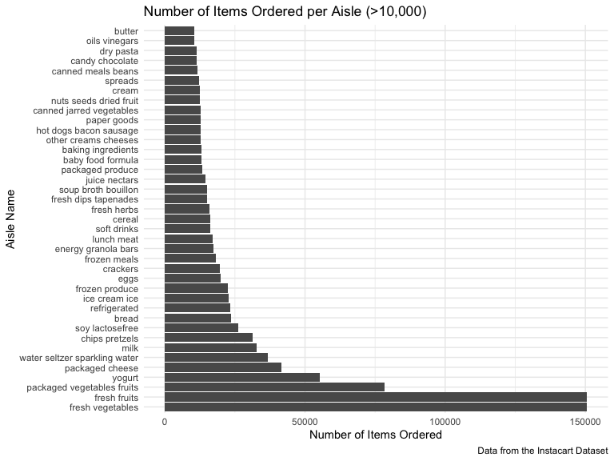

Homework\_3
================
Kodiak Soled
10/11/2019

# Prework

*Note to TAs: you may need to* `install.packages(kableExtra)` *to run my
code.*

### First, we need to load the packages we will need for this homework assignment as well as Jeff’s favorite settings that will be applied to this entire R Markdown document:

``` r
library(viridis)
```

    ## Loading required package: viridisLite

``` r
library(tidyverse)
```

    ## ── Attaching packages ────────────────────────────────────── tidyverse 1.2.1 ──

    ## ✔ ggplot2 3.2.1     ✔ purrr   0.3.2
    ## ✔ tibble  2.1.3     ✔ dplyr   0.8.3
    ## ✔ tidyr   1.0.0     ✔ stringr 1.4.0
    ## ✔ readr   1.3.1     ✔ forcats 0.4.0

    ## ── Conflicts ───────────────────────────────────────── tidyverse_conflicts() ──
    ## ✖ dplyr::filter() masks stats::filter()
    ## ✖ dplyr::lag()    masks stats::lag()

``` r
library(kableExtra)
```

    ## 
    ## Attaching package: 'kableExtra'

    ## The following object is masked from 'package:dplyr':
    ## 
    ##     group_rows

``` r
knitr::opts_chunk$set(
    echo = TRUE,
    warning = FALSE,
    fig.width = 8, 
  fig.height = 6,
  out.width = "90%"
)

options(
  ggplot2.continuous.colour = "viridis",
  ggplot2.continuous.fill = "viridis"
)

scale_colour_discrete = scale_colour_viridis_d

scale_fill_discrete = scale_fill_viridis_d

theme_set(theme_minimal() + theme(legend.position = "bottom"))
```

# Problem 1

## Instacart Dataset

### We first need to load the data from the `p8105.datasets` and tidy the dataset before we can begin exploring it:

``` r
library(p8105.datasets)
data("instacart")

cleaned_instacart = 
  instacart %>%
  janitor::clean_names() %>%
  mutate(product_name = str_to_lower(product_name))
```

### We can use the `str` function to compactly display the internal structure of the data and begin exploring its size and structure:

``` r
str(cleaned_instacart)
```

    ## Classes 'tbl_df', 'tbl' and 'data.frame':    1384617 obs. of  15 variables:
    ##  $ order_id              : int  1 1 1 1 1 1 1 1 36 36 ...
    ##  $ product_id            : int  49302 11109 10246 49683 43633 13176 47209 22035 39612 19660 ...
    ##  $ add_to_cart_order     : int  1 2 3 4 5 6 7 8 1 2 ...
    ##  $ reordered             : int  1 1 0 0 1 0 0 1 0 1 ...
    ##  $ user_id               : int  112108 112108 112108 112108 112108 112108 112108 112108 79431 79431 ...
    ##  $ eval_set              : chr  "train" "train" "train" "train" ...
    ##  $ order_number          : int  4 4 4 4 4 4 4 4 23 23 ...
    ##  $ order_dow             : int  4 4 4 4 4 4 4 4 6 6 ...
    ##  $ order_hour_of_day     : int  10 10 10 10 10 10 10 10 18 18 ...
    ##  $ days_since_prior_order: int  9 9 9 9 9 9 9 9 30 30 ...
    ##  $ product_name          : chr  "bulgarian yogurt" "organic 4% milk fat whole milk cottage cheese" "organic celery hearts" "cucumber kirby" ...
    ##  $ aisle_id              : int  120 108 83 83 95 24 24 21 2 115 ...
    ##  $ department_id         : int  16 16 4 4 15 4 4 16 16 7 ...
    ##  $ aisle                 : chr  "yogurt" "other creams cheeses" "fresh vegetables" "fresh vegetables" ...
    ##  $ department            : chr  "dairy eggs" "dairy eggs" "produce" "produce" ...

### Description

  - We can see that there are 1384617 observations of 15 variables for a
    total of 20769255 values in the Instacart dataset. The majority of
    the variables are integers, but four are character vectors
    (`department`, `aisle`, `product_name`, and `eval_set`).
  - Some key variables in this dataset include the order and product
    identifier, the name of the product, the name and identifier of the
    department and aisle, and several variables that include information
    about the ordering history of each product.
  - An illustrative example in this dataset is that an “organic hass
    avocado” (product identifier \#47209) was purchased by customer
    \#112108 at 10 am on the 4th day of the week. This produce is
    located in the “fresh fruit” aisle (aisle identifier \#24) which is
    part of the “produce” department (department identifier \#4). In
    total, there were 7293 organic hass avocados ordered in this
    dataset. Another way of looking at this dataset is that customer
    \#112108 placed an order at 10 am (order identifier \#1) which had
    eight items in it (“bulgarian yogurt”, “organic 4% milk fat whole
    milk cottage cheese”, “organic celery hearts”, “cucumber kirby”,
    “lightly smoked sardines in olive oil”, “bag of organic bananas”,
    “organic hass avocado”, and “organic whole string chees”e) which
    came from three departments (“dairy eggs”, “produce”, and “canned
    goods”).

## Problem 1 Questions

### First, we can determine the number of aisles in the Instacart dataaset by grouping the dataset by aisle (`group_by`) then counting the number of aisles (`count`). We can also determine which aisles most items are ordered from by arranging the data in descending order (`arrange(desc(n))`):

``` r
aisle = 
  cleaned_instacart %>% 
  group_by(aisle) %>%
  count() %>%
  arrange(desc(n)) 
aisle
```

    ## # A tibble: 134 x 2
    ## # Groups:   aisle [134]
    ##    aisle                              n
    ##    <chr>                          <int>
    ##  1 fresh vegetables              150609
    ##  2 fresh fruits                  150473
    ##  3 packaged vegetables fruits     78493
    ##  4 yogurt                         55240
    ##  5 packaged cheese                41699
    ##  6 water seltzer sparkling water  36617
    ##  7 milk                           32644
    ##  8 chips pretzels                 31269
    ##  9 soy lactosefree                26240
    ## 10 bread                          23635
    ## # … with 124 more rows

### Description

  - From this tibble, we can see there are 134 aisles in this dataset.
    The most orders are from the fresh vegetables and fresh fruits
    aisles with 150,609 and 150,473 orders from each aisle,
    respectively.

### Next we can make a plot using `geom_bar` within `ggplot` that shows the number of items ordered in each aisle, for aisles with more than 10,000 items ordered by using the `filter` function. We can take a few more steps so that the aisles are arranged sensibly by reordering the aisles using the `forcats::fct_reorder` function and flipping the x and y axis so it is easier to read the names of the aisles using `coord_flip`:

``` r
cleaned_instacart %>%
  count(aisle) %>%
  filter(n > 10000) %>%
  mutate(aisle = forcats::fct_reorder(aisle, n, .desc = TRUE)) %>%
  ggplot(aes(x = aisle, y = n)) +
  geom_bar(stat = "identity") + coord_flip() +
  labs(
    title = "Number of Items Ordered per Aisles (>10,000)",
    x = "Number of Items Ordered",
    y = "Aisle Name", 
    caption = "Data from the Instacart Dataset"
    )
```



### Description

  - It is also evident from this bar plot that the “fresh vegetables”
    and “fresh fruits” aisles are clearly the most popular aisles to
    order
from.

### To make a table with the three most popular items in each of the aisles “baking ingredients”, “dog food care”, and “packaged vegetables fruits”, we need to perform several steps. We need to:

  - Reduce our dataframe by first `select`ing the rows we care about
    (“aisle” and “product\_name”) then `filter`ing so only the three
    aisles we care about are present in the dataset
  - Count the number of times each product was ordered using `count`,
    group the products by the aisle they are from using `group_by`, then
    select the top three products in each aisle using `top_n`
  - Create a rank varaible to specify the popularity of each product
    from each aisle using `rank(desc(n))`
  - Organize the dataset for increased ease of reading by `arrange`ing
    the products in each aisle in descending order
  - Produce our reader-friendly table using `knitr::kable`:

<!-- end list -->

``` r
cleaned_instacart %>%
  select(aisle, product_name) %>%
  filter(
    aisle == "baking ingredients" |
      aisle == "packaged vegetables fruits" |
      aisle == "dog food care"
    ) %>%
  count(product_name, aisle) %>%
  group_by(aisle) %>%
  top_n(n = 3) %>%
  mutate(
    rank(desc(n))
    ) %>%
  rename(rank = 'rank(desc(n))') %>%
  select(aisle, product_name, n, rank) %>%
  arrange(aisle, desc(n)) %>%
  knitr::kable(caption = "Three Most Popular Items among the Baking Ingredients, Packaged Vegetable Fruits, and Dog Food Car Aisles") %>%
  kable_styling(bootstrap_options = c("striped", "condensed", font_size = 12))
```

    ## Selecting by n

<table class="table table-striped table-condensed" style="margin-left: auto; margin-right: auto;">

<caption>

Three Most Popular Items among the Baking Ingredients, Packaged
Vegetable Fruits, and Dog Food Car Aisles

</caption>

<thead>

<tr>

<th style="text-align:left;">

aisle

</th>

<th style="text-align:left;">

product\_name

</th>

<th style="text-align:right;">

n

</th>

<th style="text-align:right;">

rank

</th>

</tr>

</thead>

<tbody>

<tr>

<td style="text-align:left;">

baking ingredients

</td>

<td style="text-align:left;">

light brown sugar

</td>

<td style="text-align:right;">

499

</td>

<td style="text-align:right;">

1

</td>

</tr>

<tr>

<td style="text-align:left;">

baking ingredients

</td>

<td style="text-align:left;">

pure baking soda

</td>

<td style="text-align:right;">

387

</td>

<td style="text-align:right;">

2

</td>

</tr>

<tr>

<td style="text-align:left;">

baking ingredients

</td>

<td style="text-align:left;">

cane sugar

</td>

<td style="text-align:right;">

336

</td>

<td style="text-align:right;">

3

</td>

</tr>

<tr>

<td style="text-align:left;">

dog food care

</td>

<td style="text-align:left;">

snack sticks chicken & rice recipe dog treats

</td>

<td style="text-align:right;">

30

</td>

<td style="text-align:right;">

1

</td>

</tr>

<tr>

<td style="text-align:left;">

dog food care

</td>

<td style="text-align:left;">

organix chicken & brown rice recipe

</td>

<td style="text-align:right;">

28

</td>

<td style="text-align:right;">

2

</td>

</tr>

<tr>

<td style="text-align:left;">

dog food care

</td>

<td style="text-align:left;">

small dog biscuits

</td>

<td style="text-align:right;">

26

</td>

<td style="text-align:right;">

3

</td>

</tr>

<tr>

<td style="text-align:left;">

packaged vegetables fruits

</td>

<td style="text-align:left;">

organic baby spinach

</td>

<td style="text-align:right;">

9784

</td>

<td style="text-align:right;">

1

</td>

</tr>

<tr>

<td style="text-align:left;">

packaged vegetables fruits

</td>

<td style="text-align:left;">

organic raspberries

</td>

<td style="text-align:right;">

5546

</td>

<td style="text-align:right;">

2

</td>

</tr>

<tr>

<td style="text-align:left;">

packaged vegetables fruits

</td>

<td style="text-align:left;">

organic
blueberries

</td>

<td style="text-align:right;">

4966

</td>

<td style="text-align:right;">

3

</td>

</tr>

</tbody>

</table>

### Lastly, we can make a table of the mean hour of the day that “Pink Lady Apples” and “Coffee Ice Cream” were ordered on each day of the week by the following steps:

  - Reduce our dataframe using `filter` so “Pink Lady Apples” and
    “Coffee Ice Cream” are the only products present, then using
    `select` so “order\_dow”, “product\_name”, and
    “order\_hour\_of\_day” are the only variables present.
  - Organize the dataset by: renaming “order\_dow” to “day\_of\_week”
    using `mutate`, recoding the days of the week from 0-6 to
    Sunday-Saturday using `recode`, and reordering the days of the week
    from “monday” to “sunday” using `forcats::fct_relevel`
  - Obtain the mean hour of the day each product was ordered by first
    grouping the product and the day of the week it was ordered, then
    using `sumarize` to compute the mean hour of the day each product
    (“Pink Lady Apples” and “Coffee Ice Cream”) was ordered on each
    day of the week (monday-sunday)
  - Organize the dataset to make more reader friendly by pivoting the
    table from long to wide using `pivot_wider` so the variable names
    are the two products (“Pink Lady Apples” and “Coffee Ice Cream”),
    the rows are the days of the week (monday-sunday), and the values
    are the mean time of day each product was ordered
  - Produce our reader-friendly table using `knitr::kable`:

<!-- end list -->

``` r
cleaned_instacart %>%
  filter(
    product_name == "pink lady apples" | 
      product_name == "coffee ice cream"
    ) %>%
  select(order_dow, product_name, order_hour_of_day) %>%
  mutate(
    day_of_week = recode(order_dow,
                         `1` = "monday", 
                         `2` = "tuesday", 
                         `3` = "wednesday", 
                         `4` = "thursday", 
                         `5` = "friday", 
                         `6` = "saturday",
                         `0` = "sunday"),
    day_of_week = forcats::fct_relevel(day_of_week, c("monday", "tuesday", "wednesday", "thursday", "friday", "saturday", "sunday"))
    ) %>%
  group_by(product_name, day_of_week) %>%
  summarize(mean_hour = mean(order_hour_of_day)) %>%
  pivot_wider(
    names_from = "product_name",
    values_from = "mean_hour"
  ) %>%
   knitr::kable(digit = 1, caption = "Mean Hour of Day Pink Lady Apples and Coffee Ice Cream is Ordered Each Day of Week") %>% 
  kable_styling(bootstrap_options = c("striped", "condensed", font_size = 12))
```

<table class="table table-striped table-condensed" style="margin-left: auto; margin-right: auto;">

<caption>

Mean Hour of Day Pink Lady Apples and Coffee Ice Cream is Ordered Each
Day of Week

</caption>

<thead>

<tr>

<th style="text-align:left;">

day\_of\_week

</th>

<th style="text-align:right;">

coffee ice cream

</th>

<th style="text-align:right;">

pink lady apples

</th>

</tr>

</thead>

<tbody>

<tr>

<td style="text-align:left;">

monday

</td>

<td style="text-align:right;">

14.3

</td>

<td style="text-align:right;">

11.4

</td>

</tr>

<tr>

<td style="text-align:left;">

tuesday

</td>

<td style="text-align:right;">

15.4

</td>

<td style="text-align:right;">

11.7

</td>

</tr>

<tr>

<td style="text-align:left;">

wednesday

</td>

<td style="text-align:right;">

15.3

</td>

<td style="text-align:right;">

14.2

</td>

</tr>

<tr>

<td style="text-align:left;">

thursday

</td>

<td style="text-align:right;">

15.2

</td>

<td style="text-align:right;">

11.6

</td>

</tr>

<tr>

<td style="text-align:left;">

friday

</td>

<td style="text-align:right;">

12.3

</td>

<td style="text-align:right;">

12.8

</td>

</tr>

<tr>

<td style="text-align:left;">

saturday

</td>

<td style="text-align:right;">

13.8

</td>

<td style="text-align:right;">

11.9

</td>

</tr>

<tr>

<td style="text-align:left;">

sunday

</td>

<td style="text-align:right;">

13.8

</td>

<td style="text-align:right;">

13.4

</td>

</tr>

</tbody>

</table>

  - We can see from this table that both coffee ice cream and pink lady
    apples orders are on average placed between 11 am and 4 pm. Cofee
    ice cream also tends to be ordered later in the da than pink lady
    apples.

# Problem 2

## BRFSS Dataset

### We first need to load the brfss data from the `p8105.datasets`:

``` r
library(p8105.datasets)
data("brfss_smart2010")
```
